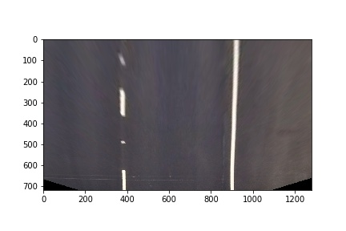
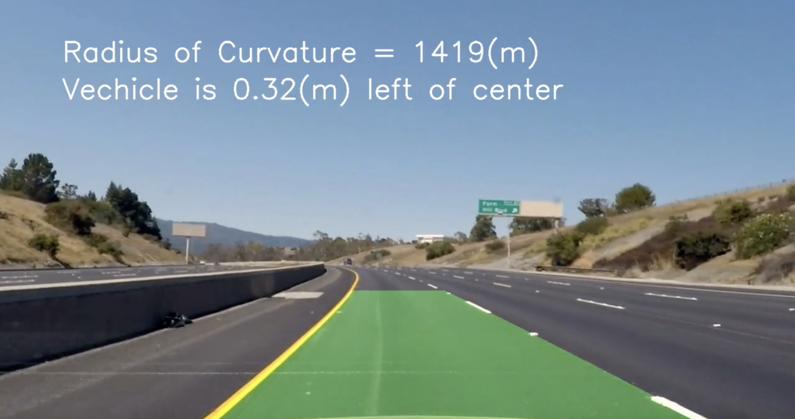

## Writeup Template

### You can use this file as a template for your writeup if you want to submit it as a markdown file, but feel free to use some other method and submit a pdf if you prefer.

---

**Advanced Lane Finding Project**

The goals / steps of this project are the following:

* Compute the camera calibration matrix and distortion coefficients given a set of chessboard images.
* Apply a distortion correction to raw images.
* Use color transforms, gradients, etc., to create a thresholded binary image.
* Apply a perspective transform to rectify binary image ("birds-eye view").
* Detect lane pixels and fit to find the lane boundary.
* Determine the curvature of the lane and vehicle position with respect to center.
* Warp the detected lane boundaries back onto the original image.
* Output visual display of the lane boundaries and numerical estimation of lane curvature and vehicle position.

[//]: # (Image References)

[image1]: ./examples/undistort_output.png "Undistorted"
[image2]: ./test_images/test1.jpg "Road Transformed"
[image3]: ./examples/binary_combo_example.jpg "Binary Example"
[image4]: ./examples/warped_straight_lines.jpg "Warp Example"
[image5]: ./examples/color_fit_lines.jpg "Fit Visual"
[image6]: ./examples/example_output.jpg "Output"
[video1]: ./project_video.mp4 "Video"

## [Rubric](https://review.udacity.com/#!/rubrics/571/view) Points

### Here I will consider the rubric points individually and describe how I addressed each point in my implementation.  

---

### Writeup / README

#### 1. Provide a Writeup / README that includes all the rubric points and how you addressed each one.  You can submit your writeup as markdown or pdf.  [Here](https://github.com/udacity/CarND-Advanced-Lane-Lines/blob/master/writeup_template.md) is a template writeup for this project you can use as a guide and a starting point.  

You're reading it!

### Camera Calibration

#### 1. Briefly state how you computed the camera matrix and distortion coefficients. Provide an example of a distortion corrected calibration image.

The code for this step is contained in the first code cell of the IPython notebook located in "./P4.ipynb"

I start by preparing "object points", which will be the (x, y, z) coordinates of the chessboard corners in the world. Here I am assuming the chessboard is fixed on the (x, y) plane at z=0, such that the object points are the same for each calibration image.  Thus, `objp` is just a replicated array of coordinates, and `objpoints` will be appended with a copy of it every time I successfully detect all chessboard corners in a test image.  `imgpoints` will be appended with the (x, y) pixel position of each of the corners in the image plane with each successful chessboard detection.  

I then used the output `objpoints` and `imgpoints` to compute the camera calibration and distortion coefficients using the `cv2.calibrateCamera()` function.  I applied this distortion correction to the test image using the `cv2.undistort()` function. 

Please check the P4.ipynb, it has examples for this

### Pipeline (single images)

#### 1. Provide an example of a distortion-corrected image.

Please check the P4.ipynb, it has examples for this

#### 2. Describe how (and identify where in your code) you used color transforms, gradients or other methods to create a thresholded binary image.  Provide an example of a binary image result.

I created a majority vote function to try every combination as many as possible

```python

thresholds = {
    'gray': [180, 255],
    'R': [190, 255],
    'G': [170, 255],
    'B': [0, 100],
    'H': [15, 100],
    'L': [150, 255],
    'S': [90, 255],
    'X': [10, 150],
    'Y': [10, 150],
    'XY': [20, 200],
    'X/Y': [0.7, 1.3]
}

thresh_funcs = {
    'gray': ColorThreshold('gray'),
    'R': ColorThreshold('RGB', 0),
    'G': ColorThreshold('RGB', 1),
    'B': ColorThreshold('RGB', 2),
    'H': ColorThreshold('HLS', 0),
    'L': ColorThreshold('HLS', 1),
    'S': ColorThreshold('HLS', 2),
    'X': GradientAbsThreshold('x', sobel_kernel=3),
    'Y': GradientAbsThreshold('y', sobel_kernel=3),
    'XY': GradientMagThreshold(sobel_kernel=3),
    'X/Y': GradientDirThreshold(sobel_kernel=15)
}


def majority_vote(image, thresh_names, n_vote):
    global thresholds
    global thresh_funcs
    
    shape = image.shape
    sum_binary = np.zeros(shape[:2])
    for name in thresh_names:
        sum_binary += thresh_funcs[name].applyThreshold(image, thresholds[name])
    
    vote_binary = np.zeros_like(sum_binary)
    vote_binary[sum_binary >= n_vote] = 1
    
    return vote_binary

```

Eventually, I choose three filters, two using color threshold, one using gradient threshold, after enormous trials and parameters tuning. They are: 
```python
vote_binary = majority_vote(image, ['S', 'R', 'X'], 2)
```
Please check notebook P4.ipynb for more details

#### 3. Describe how (and identify where in your code) you performed a perspective transform and provide an example of a transformed image.

The code for my perspective transform includes a function called `warper()`, which appears in lines 1 through 8 in the file `example.py` (output_images/examples/example.py) (or, for example, in the 3rd code cell of the IPython notebook).  The `warper()` function takes as inputs an image (`img`), as well as source (`src`) and destination (`dst`) points.  I chose the hardcode the source and destination points in the following manner:

```python
# Generate the M, inv_M for straight line and store them
size = (1280, 720)
offset = 320 # 380
# top_right, top_left, bottom_left, bottom_right
#src = np.float32([[582, 460], [700, 460], [1017, 660], [292, 660]])
src = np.float32([[570, 470], [720, 470], [1130, 720], [200, 720]])
dst = np.float32([[offset, 0], [size[0]-offset, 0], [size[0]-offset, 720], [offset, 720]])
```

This resulted in the following source and destination points:

| Source        | Destination   | 
|:-------------:|:-------------:| 
| 570, 470      | 320, 0        | 
| 720, 470      | 960, 0      |
| 1130, 720     | 960, 720      |
| 200, 720      | 320, 720        |

I verified that my perspective transform was working as expected by drawing the `src` and `dst` points onto a test image and its warped counterpart to verify that the lines appear parallel in the warped image.



#### 4. Describe how (and identify where in your code) you identified lane-line pixels and fit their positions with a polynomial?

Please check section **Lane Finding and Calculate Curvature** for these codes.

#### 5. Describe how (and identify where in your code) you calculated the radius of curvature of the lane and the position of the vehicle with respect to center.

Please check section **Lane Finding and Calculate Curvature** for these codes.

#### 6. Provide an example image of your result plotted back down onto the road such that the lane area is identified clearly.

I implemented this step in lines # through # in my code in `yet_another_file.py` in the function `map_lane()`.  Here is an example of my result on a test image:



---

### Pipeline (video)

#### 1. Provide a link to your final video output.  Your pipeline should perform reasonably well on the entire project video (wobbly lines are ok but no catastrophic failures that would cause the car to drive off the road!).

Here's a [link to my video result](./project_video_labeled.mp4)
Here's a [link to my not-fine-tunned challenging video result](./challenge_video_labeled.mp4)

---

### Discussion

#### 1. Briefly discuss any problems / issues you faced in your implementation of this project.  Where will your pipeline likely fail?  What could you do to make it more robust?

Here I'll talk about the approach I took, what techniques I used, what worked and why, where the pipeline might fail and how I might improve it if I were going to pursue this project further.
